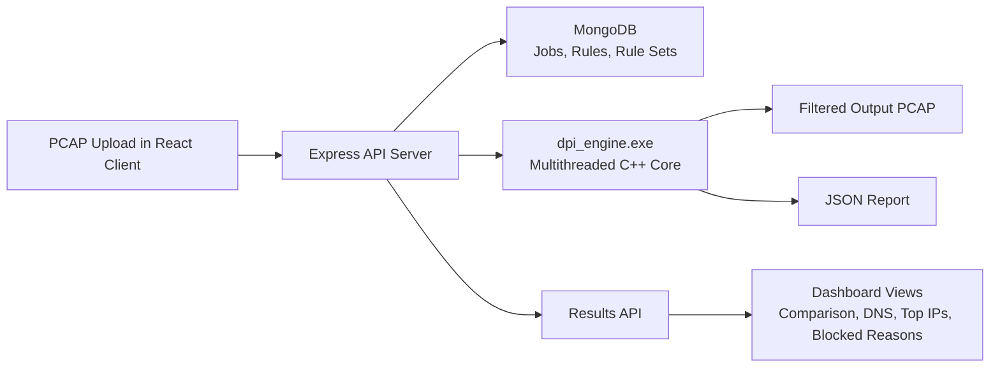

# DPI Engine - Deep Packet Inspection System

A multithreaded C++ DPI engine with a MERN dashboard for offline PCAP analysis, rule-based blocking, and traffic visualization.

## What This Project Does

- Parses packets from `.pcap` captures
- Tracks connections using five-tuple flow state
- Extracts TLS SNI / HTTP host information when available
- Supports blocking by app, domain, IP, and protocol
- Exports JSON reports for dashboard analytics
- Visualizes dropped traffic, DNS activity, top IPs, ports, and protocols
- Lets you save reusable rule-set profiles from the web UI

## Architecture Diagram



## System Layout

```text
Packet_analyzer/
|-- include/              C++ headers
|-- src/                  C++ engine sources
|-- dpi_engine.exe        Built analyzer executable
|-- client/               React + Vite dashboard
|-- server/               Express + Mongo API
|-- docs/screenshots/     README image assets
|-- test_dpi.pcap         Sample capture
|-- CMakeLists.txt        Native build config
`-- README.md             Project overview
```

## Main Workflow

1. Upload a `.pcap` from the React dashboard.
2. The Express server stores the job and launches `dpi_engine.exe`.
3. The C++ engine parses packets, applies rules, and writes:
   - a filtered `.pcap`
   - a JSON report
   - standard log output
4. The dashboard loads the report and renders:
   - packet totals
   - blocked traffic percentage
   - blocked reasons
   - DNS query analytics
   - top IPs, ports, and protocols

## Current Feature Set

### Engine
- Offline PCAP analysis
- Multithreaded load balancer + fast-path processing
- Flow tracking and classification
- SNI / host extraction
- DNS query analytics
- Blocking by IP, app, domain, and protocol
- Basic ICS protocol-family support for `MODBUS` and `S7`
- JSON report export with traffic analytics

### Dashboard
- Upload and run analysis jobs
- Results comparison view
- Blocked reason breakdown
- DNS query table
- Top source/destination IP analytics
- Top destination ports and protocols
- Saved rule sets
- Clear helper text for rule fields

## Run The Project

### C++ Engine Only

```powershell
cd D:\Packet_analyzer
.\dpi_engine.exe test_dpi.pcap output.pcap --report-json report.json
```

### MERN Dashboard

Server:

```powershell
cd D:\Packet_analyzer\server
npm run dev
```

Client:

```powershell
cd D:\Packet_analyzer\client
npm run dev
```

Open [http://localhost:5173](http://localhost:5173).

## Good Demo Scenarios

### ICS Capture Demo
Use the Netresec 4SICS capture and block a known active host such as `192.168.88.61`.

Expected result:
- dropped packets increase
- blocked reason shows `IP: 192.168.88.61`
- comparison view shows blocked percentage

### Protocol Blocking Demo
Use `Block Protocols = DNS` or `ICMP` on an ICS-oriented capture.

Expected result:
- dropped packets increase
- blocked reasons show `PROTOCOL: DNS` or `PROTOCOL: ICMP`
- DNS table reflects blocked query counts

### Consumer App Demo
Use `test_dpi.pcap` and block `YouTube` or `Google`.

Expected result:
- app blocking works when SNI/host extraction identifies the traffic
- blocked reasons show `APP: YouTube` or similar

## Screenshot Gallery

Drop your UI captures into `docs/screenshots/` using the file names below and the README will render them automatically.

### Dashboard Home


### Analyze Job Launcher


### Results Comparison


### Results DNS Analytics


### Rules Saved Profiles


## Screenshot Capture Checklist

Recommended screenshots:
1. Dashboard home with service status and recent jobs
2. Analyze page with a saved rule set selected
3. Results page showing traffic comparison and blocked reasons
4. Results page showing DNS analytics and top IPs
5. Rules page showing saved rule sets

Expected file names under `docs/screenshots/`:
- `dashboard-home.png`
- `analyze-job-launcher.png`
- `results-comparison.png`
- `results-dns-analytics.png`
- `rules-saved-profiles.png`

## Security Scope and Limitations

This project demonstrates core DPI and traffic-control concepts well, but it is currently an offline PCAP analysis platform, not a hardened production security appliance.

### What Is Covered

- Packet parsing and flow tracking
- Rule-based filtering by IP, app, domain, and protocol
- TLS SNI / HTTP host visibility when available
- DNS query analytics
- Basic protocol-aware filtering for traffic such as `DNS`, `ICMP`, `MODBUS`, and `S7`
- JSON reporting and dashboard visualization

### What Is Not Fully Handled Yet

- Live inline packet interception and real-time blocking
- Full encrypted-traffic inspection beyond visible metadata
- Authentication and authorization for dashboard users
- Hardened file upload validation and malware-safe processing
- Secure sandboxing / isolation of engine execution
- Rate limiting and abuse protection on backend APIs
- Full IDS/IPS signature detection
- Deep ICS protocol parsing beyond basic protocol-family identification
- SIEM integration, alert pipelines, and incident workflows
- Tamper-resistant audit logging and enterprise-grade access control

## Security Gaps and Future Work

Recommended next steps if this project is extended toward production-grade security tooling:

1. Add authentication, authorization, and role-based access control for the dashboard.
2. Harden the upload pipeline with file validation, size limits, and safer job isolation.
3. Run the packet-processing engine in a restricted sandbox or worker environment.
4. Add structured audit logs for uploads, rule changes, job execution, and downloads.
5. Introduce live capture mode for real-time monitoring and blocking experiments.
6. Expand protocol parsers for deeper `Modbus`, `S7`, and other ICS protocol inspection.
7. Add IDS-style signatures, alerting, and optional threat-intelligence enrichment.
8. Protect the API with rate limits, input validation, and secure deployment defaults.

## Resume-Ready Summary

Built a multithreaded Deep Packet Inspection engine in C++ for offline PCAP analysis, rule-based blocking, DNS/SNI inspection, and JSON report generation, then integrated it with a MERN dashboard for job control, reusable policy sets, and traffic analytics.

## Deep Technical Walkthrough

The original long-form explanation for packet flow, SNI extraction, multithreading, and code structure is preserved in [PROJECT_DEEP_DIVE.md](./PROJECT_DEEP_DIVE.md).
