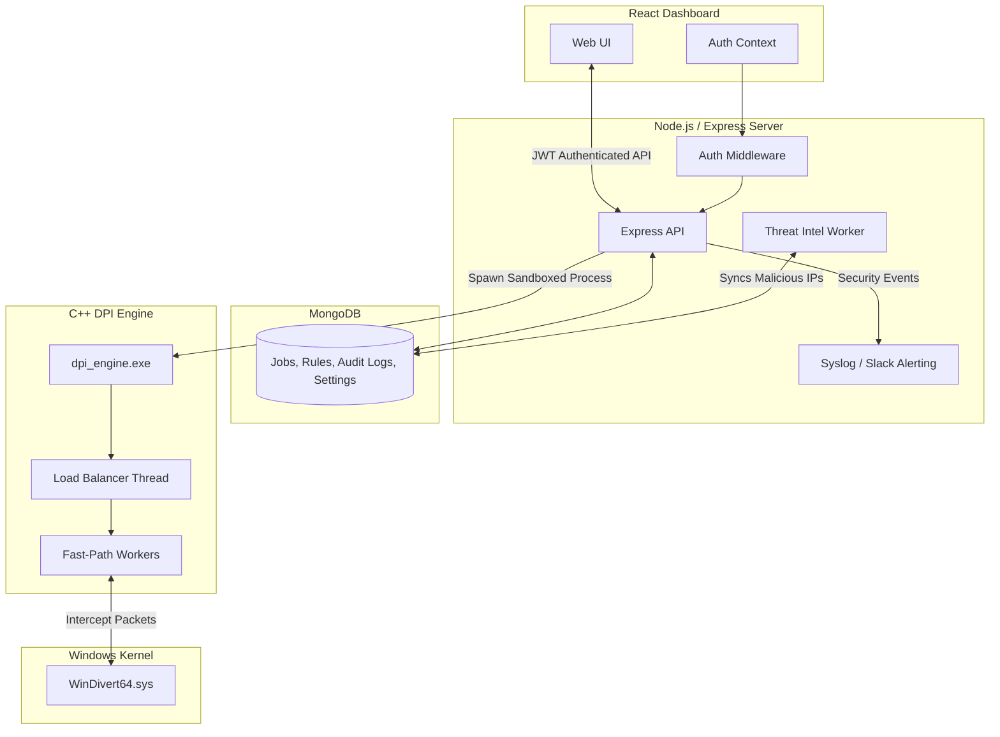

# Enterprise Deep Packet Inspection (DPI) Firewall

A high-performance, multithreaded C++ DPI engine coupled with a modern MERN-stack command dashboard. This system is capable of both **offline PCAP analysis** and **live kernel-level traffic interception** (via WinDivert).

It features Zero-Trust authentication, process sandboxing, automated Threat Intelligence synchronization, and enterprise integrations (SIEM/Syslog/Slack).

---

## 🏗️ System Layout

```text
Packet_analyzer/
|-- engine/                 [C++ High-Performance DPI Engine]
|   |-- include/            C++ header files (types, parsers, engine)
|   |-- src/                C++ source files (load balancer, fast path, rules)
|   `-- lib/                WinDivert libraries
|-- server/                 [Node.js / Express / MongoDB Backend]
|   |-- src/
|   |   |-- models/         MongoDB Schemas (Job, AuditLog, Settings, ThreatIntel)
|   |   |-- routes/         API Endpoints (Jobs, Settings, Auth, ThreatIntel)
|   |   |-- services/       Orchestrators (engineService, integrationService, threatIntelService)
|   |   `-- middleware/     Zero-Trust Security (JWT, RBAC Admin/Viewer)
|   `-- data/               Uploads, Output PCAPs, JSON Reports
|-- client/                 [React / Vite Frontend Dashboard]
|   |-- src/
|   |   |-- components/     Reusable UI components
|   |   |-- contexts/       React Contexts (AuthContext)
|   |   `-- pages/          Dashboard views (Analyze, Results, Audit, Settings)
|-- WinDivert/              WinDivert 1.4 package and drivers
|-- Run_Backend_Admin.bat   Auto-elevation launch script for Live Interception
|-- dpi_engine.exe          Compiled C++ Engine executable
`-- README.md               Project documentation
```

---

## 🏛️ Architecture Diagram



---

## ⚙️ Main Workflow

1. **Authentication:** User accesses the React dashboard (Authentication currently bypassed for local ease of use, but JWT/RBAC middleware is fully implemented).
2. **Job Configuration:** User uploads a `.pcap` file OR selects **Live Interception**. They configure blocking rules (Domains, Apps, IPs, Protocols).
3. **Orchestration:** The Express server records the job in MongoDB and launches `dpi_engine.exe` in a strictly isolated subprocess.
4. **Execution:** The C++ engine utilizes a Load Balancer to hash flows to multithreaded Fast-Path workers. It hooks into the network stack using WinDivert (if live) or reads the PCAP (if offline).
5. **Enforcement & Intelligence:** Packets are parsed (SNI/DNS extracted) and matched against user rules AND the automated Threat Intel blocklist.
6. **Reporting:** The engine outputs a filtered PCAP and a comprehensive JSON analytics report.
7. **Visualization & Alerting:** The React dashboard renders traffic comparisons and DNS analytics. The backend simultaneously fires Syslog events to your SIEM and Slack Webhooks if malicious traffic was blocked.

---

## 🔒 Enterprise Security Features

This project was built with production-grade security architecture in mind:

- **Live Kernel-Level Interception:** Real-time traffic monitoring and blocking using WinDivert.
- **Zero-Trust Authentication:** JWT-based session management and Role-Based Access Control (Admin vs Viewer roles).
- **Process Sandboxing:** The C++ DPI engine execution environment is hardened (ASLR, DEP, Stack Smash Protectors) and strictly isolated from the Node.js process.
- **Malware-Safe Uploads:** Robust file validation, sanitization, and size limits to prevent malicious PCAP execution.
- **Comprehensive Audit Logging:** Immutable MongoDB logs of all user actions (logins, rule changes, job executions).
- **Automated Threat Intelligence:** Background workers continuously sync and apply thousands of malicious IPs from external blocklists (e.g., Firehol Level 1).
- **SIEM & Real-Time Alerting:** Immediate job status and security event forwarding to Syslog servers and Slack Webhooks.

---

## 🚀 Run The Project

### 1. Start the Backend (Admin Required for Live Interception)
To use Live Interception, the Node.js server *must* run as Administrator so it can grant the C++ engine permission to inject the WinDivert driver.

Navigate to the project root and double-click:
**`Run_Backend_Admin.bat`**
*(This will automatically request UAC Admin privileges and start the Express server on `http://localhost:8000`)*

### 2. Start the Frontend Dashboard
Open a standard terminal (no admin required):
```powershell
cd D:\Packet_analyzer\client
npm run dev
```

### 3. Access the System
Open [http://localhost:5173](http://localhost:5173) in your browser.

---

## 📸 Screenshot Capture Checklist

If you want to document this project for your portfolio, it is recommended to take the following screenshots and place them in `docs/screenshots/`:

1. **Dashboard Home** (`dashboard-home.png`): Showing service status and recent jobs.
2. **Analyze Job Launcher** (`analyze-job-launcher.png`): Showing the rule configuration and Live Mode toggle.
3. **Results Comparison** (`results-comparison.png`): Showing the traffic split (Forwarded vs Dropped) and blocked reasons.
4. **DNS Analytics** (`results-dns-analytics.png`): Showing the parsed domains.
5. **Settings & Integrations** (`settings.png`): Showing the Threat Intel and SIEM configuration page.
6. **Audit Logs** (`audit-logs.png`): Showing the immutable security trail.

---

## 📄 Resume-Ready Summary

Built a multithreaded Deep Packet Inspection firewall in C++ capable of offline PCAP analysis and **live kernel-level traffic interception** (WinDivert). Engineered a secure MERN dashboard with Zero-Trust authentication (JWT/RBAC), process sandboxing, automated Threat Intelligence ingestion, and real-time SIEM/Slack alerting to command the engine and visualize traffic analytics.
